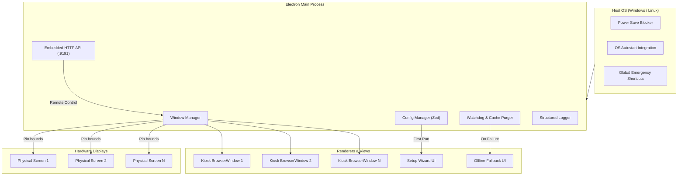

<div align="center">

# Webpage Signage Runner

**Production-grade, unattended Multi-Display Digital Signage Kiosk orchestrator for Windows and Linux.**

[](LICENSE)
[](https://www.typescriptlang.org/)
[](https://www.electronjs.org/)
[](DEPLOYMENT.md)
[](https://github.com/mcontartesi)

<p align="center">
  <a href="#key-features">Key Features</a> •
  <a href="#quick-start">Quick Start</a> •
  <a href="#first-run-wizard">First-Run Wizard</a> •
  <a href="#configuration">Configuration</a> •
  <a href="#remote-http-api">Remote HTTP API</a> •
  <a href="#resilience--watchdog">Watchdog</a> •
  <a href="#guía-en-español">Español</a>
</p>

</div>

---

## Key Features

- **Dynamic Multi-Display Orchestration**: Automatically enumerates all connected physical screens (`screen.getAllDisplays()`) and pins independent, borderless, always-on-top kiosk windows to each screen's exact coordinates.
- **Dynamic Hot-Plugging**: Seamlessly reacts to monitor connection and disconnection events (`display-added`, `display-removed`) without crashing or restarting the application.
- **First-Run Dark Mode Setup Wizard**: If no configuration exists, boots into an intuitive dark-mode setup wizard to discover screens, assign URLs, configure zoom levels, and test connectivity.
- **Visual Screen Identification**: Flashes prominent screen index overlay numbers on all physical monitors at the click of a button so installers know exactly which monitor is which.
- **Self-Healing Process Watchdog**:
  - Automatically intercepts network/loading failures and transitions to a branded **Offline Fallback UI** with live countdown timer and auto-retry loop.
  - Automatically restarts/recovers renderers on `unresponsive` or `render-process-gone` (crashes / OOM).
  - Performs scheduled background cache purges (`reloadIntervalMinutes`) to eliminate Chromium 24/7 memory leaks.
- **Embedded HTTP REST & Health API**: Integrated local server (default port `9191`) for health checks (`/health`), system status (`/api/status`), remote reloads, dynamic URL changes, and live screenshot captures.
- **OS Integration & Polishing**:
  - Prevents system sleep and monitor standby using `electron.powerSaveBlocker`.
  - Automatic mouse cursor suppression via CSS injection (`* { cursor: none !important; }`).
  - Automatic startup on boot for Windows (LoginItems) and Linux (`.desktop` / `systemd`).
  - Emergency admin escape hotkey (`Ctrl+Shift+C` / `CmdOrCtrl+Alt+S`).

---

## System Architecture



---

## Quick Start

### 1. Prerequisites
- [Node.js](https://nodejs.org/) v20.x or v22.x LTS
- npm v10+

### 2. Clone & Install
```bash
git clone https://github.com/mcontartesi/webpage-signage-runner.git
cd webpage-signage-runner
npm install
```

### 3. Launch in Development Mode
```bash
npm run dev
```

### 4. Production Build
```bash
# Build TypeScript and assets
npm run build

# Package installers
npm run dist:win    # Windows NSIS & Portable .exe
npm run dist:linux  # Linux AppImage & .deb
```

---

## First-Run Wizard

When launching without an existing `config.json` file:
1. The application opens the **Dark-Mode Setup Wizard**.
2. All connected displays are enumerated with resolution, refresh rate, and coordinates.
3. Click **"Identify Screens"** to flash large numbers on every screen.
4. Input the desired target URL for each display (e.g. dashboards, Grafana, PowerBI, video walls).
5. Click **"Save & Launch Kiosk Mode"** to save `config.json` atomically and start running immediately.

> [!TIP]
> **Emergency Recovery Shortcut:** Press **`Ctrl + Shift + C`** (or **`CmdOrCtrl + Alt + S`**) at any time on the physical keyboard to unlock the kiosk and reopen the Setup Wizard.

---

## Configuration (`config.json`)

Configurations are saved under `app.getPath('userData')/config.json`:
- **Windows:** `%APPDATA%/webpage-signage-runner/config.json`
- **Linux:** `~/.config/webpage-signage-runner/config.json`

### Example `config.json`
```json
{
  "version": "1.0.0",
  "defaultUrl": "https://antigravity.google",
  "hideCursorGlobal": true,
  "defaultReloadIntervalMinutes": 60,
  "defaultRetryIntervalSeconds": 10,
  "autoStartOnBoot": true,
  "emergencyShortcut": "CommandOrControl+Shift+C",
  "api": {
    "enabled": true,
    "port": 9191,
    "host": "0.0.0.0",
    "authToken": "",
    "cors": true
  },
  "watchdog": {
    "maxRetries": 10,
    "unresponsiveTimeoutSeconds": 15,
    "clearCacheOnReload": true,
    "autoRecoverCrashes": true
  },
  "displays": [
    {
      "id": 1,
      "label": "Lobby 4K Display",
      "url": "https://grafana.internal/d/lobby-metrics?kiosk",
      "reloadIntervalMinutes": 60,
      "retryIntervalSeconds": 10,
      "hideCursor": true,
      "zoomFactor": 1.0,
      "enabled": true
    }
  ]
}
```

---

## Remote HTTP REST API & Swagger UI

Webpage Signage Runner features an embedded HTTP server (port `9191` by default) for remote monitoring, central management, and interactive API exploration.

- **Interactive Swagger UI:** Navigate to `http://<kiosk-ip>:9191/` (or `http://<kiosk-ip>:9191/docs`) in any browser to access the complete Swagger UI documentation with live request testing and schemas.
- **OpenAPI 3.0 JSON:** `http://<kiosk-ip>:9191/openapi.json`

| Method | Endpoint | Description |
|---|---|---|
| `GET` | `/` or `/docs` | Interactive Swagger UI Documentation Explorer |
| `GET` | `/openapi.json` | OpenAPI 3.0 JSON Specification |
| `GET` | `/health` | Fast liveness probe (`200 OK`) |
| `GET` | `/api/status` | Complete node telemetry, uptime, memory, and display states |
| `POST` | `/api/reload` | Triggers immediate cache clear & reload on all screens |
| `POST` | `/api/displays/:id/reload` | Reloads a specific screen |
| `POST` | `/api/displays/:id/url` | Pushes a new URL to a display live (optional `{"persist": true}`) |
| `GET` | `/api/displays/:id/screenshot` | Captures an instant PNG screenshot of what the screen is displaying |
| `POST` | `/api/identify` | Flashes screen identification numbers across all monitors |
| `POST` | `/api/setup` | Opens the Setup Wizard remotely |

For complete API documentation, headers, and `curl` examples, see [API.md](API.md).

---

## Resilience & Watchdog

- **Network Failures:** In case of connection dropout, displays automatically render `offline.html` showing diagnostics and an animated countdown before retrying. When the OS network adapter reconnects (`navigator.onLine`), it reloads immediately.
- **Renderer Crashes / OOM:** The watchdog listens to `render-process-gone` and `unresponsive` events to automatically reboot the crashed display window without requiring an OS restart.
- **Memory Purge:** Every `reloadIntervalMinutes`, Chromium's cache and memory storage are purged to avoid long-term JavaScript memory leaks in 24/7 setups.
- **Structured Logs:** Stored in `userData/logs/signage-YYYY-MM-DD.log` with automatic 7-day log retention.

---

## Production Hardening

For step-by-step instructions on setting up Windows AutoLogon, Windows Shell Launcher, Linux systemd user services, and Wayland/X11 kiosk mode, please refer to the [Production Deployment Guide (DEPLOYMENT.md)](DEPLOYMENT.md).

---

## Guía en Español

### Descripción General
**Webpage Signage Runner** es un sistema de cartelería digital multi-pantalla desatendido y de grado de producción para Windows y Linux, creado como software de código abierto por **Maximiliano Contartesi**.

### Características Principales
1. **Gestión Dinámica Multi-Monitor**: Detecta automáticamente todas las pantallas físicas conectadas y proyecta ventanas independientes sin bordes en modo Kiosk fijadas a las coordenadas exactas de cada pantalla.
2. **Soporte Hot-Plug**: Maneja la conexión y desconexión de pantallas en caliente sin reiniciar la aplicación.
3. **Asistente de Configuración Inicial (Dark Mode)**: Si no existe configuración previa, inicia un asistente visual para identificar monitores, probar URLs y configurar parámetros.
4. **Identificación Visual de Pantallas**: Muestra números gigantes en cada monitor al presionar "Identify Screens" para facilitar la instalación física.
5. **Watchdog y Autorecuperación**:
   - Detecta fallos de red y muestra una pantalla offline con temporizador de reintento automático.
   - Recupera procesos colgados o caídos por falta de memoria (OOM).
   - Limpia periódicamente la caché de Chromium para evitar fugas de memoria en funcionamiento 24/7.
6. **API HTTP REST Embebida con Swagger UI (Puerto 9191)**: Permite monitoreo de estado, cambios remotos de URL, capturas de pantalla y reinicio. Incluye interfaz interactiva Swagger UI en `http://<ip>:9191/` (o `/docs`) para explorar y probar endpoints en vivo.
7. **Arranque Automático con el Sistema**: Configuración integrada para iniciar junto con Windows o Linux.
8. **Atajo de Emergencia**: Presiona **`Ctrl + Shift + C`** o **`CmdOrCtrl + Alt + S`** para salir del modo kiosk y abrir la configuración.

---

## License

Distributed under the **MIT License**. See [LICENSE](LICENSE) for more information.

Created by **Maximiliano Contartesi**.
