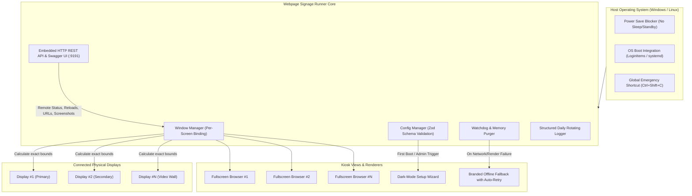

# Webpage Signage Runner Wiki

Welcome to the official technical documentation and user guide for **Webpage Signage Runner**, the enterprise-grade, unattended Multi-Display Digital Signage Kiosk orchestrator for Windows and Linux.

---

## 🌟 Overview

**Webpage Signage Runner** is an open-source, resilient kiosk runner engineered for 24/7 mission-critical displays, video walls, airport screens, office lobbies, retail directories, and operation centers. Built with **TypeScript** and **Electron**, it solves common digital signage challenges such as multi-monitor coordinate alignment, memory leaks in 24/7 web apps, network dropouts, and remote management.

---

## 📑 Wiki Navigation Table of Contents

| Section | Description | Page Link |
|---|---|---|
| 🚀 **Quick Start Guide** | End-user 3-step guide, download links, portable mode, emergency hotkeys | [[Quick Start Guide\|Quick-Start-Guide]] |
| 🖥️ **Multi-Display Orchestration** | Physical monitor detection, coordinate pinning, DPI scaling, hot-plugging | [[Multi-Display Orchestration\|Multi-Display-Orchestration]] |
| 🎨 **First-Run Wizard & UI** | Dark-mode setup GUI, visual monitor numbering overlay, URL configuration | [[First-Run Wizard & UI\|First-Run-Wizard-&-UI]] |
| 🔐 **HTTP & Authentication** | GET/POST/PUT methods, Bearer tokens, API keys, JSON payloads | [[HTTP & Authentication\|HTTP-&-Authentication]] |
| ⚙️ **Configuration Reference** | Full `config.json` schema, options, watchdog parameters, paths | [[Configuration Reference\|Configuration-Reference]] |
| 🌐 **REST API & Swagger UI** | Remote HTTP management, interactive Swagger UI on port 9191, OpenAPI 3.0 | [[REST API & Swagger UI\|REST-API-&-Swagger-UI]] |
| 🛡️ **Resilience & Watchdog** | Offline fallback countdown, crash recovery, 24/7 memory cache purge | [[Resilience, Watchdog & Recovery\|Resilience,-Watchdog-&-Recovery]] |
| 🏭 **Production Hardening** | Windows AutoLogon, Shell Launcher, Linux systemd service, unclutter | [[Production Hardening & Deployment\|Production-Hardening-&-Deployment]] |
| 🛠️ **Developer & Build Guide** | TypeScript architecture, esbuild bundling, Vitest, packaging installers | [[Developer & Build Guide\|Developer-&-Build-Guide]] |
| ❓ **Troubleshooting & FAQ** | Common setup questions, port conflicts, emergency hotkey recovery | [[Troubleshooting & FAQ\|Troubleshooting-&-FAQ]] |
| 🇪🇸 **Guía en Español** | Documentación y guía de referencia completa en español | [[Guía en Español\|Guia-en-Espanol]] |
| 👤 **About & Credits** | Author profile, contact links, architectural decisions, and license | [[About & Author\|About-&-Author]] |

---

## 🎯 Key Architectural Pillars

### 1. Zero Configuration Barrier
Install and launch. If no configuration exists, the application automatically launches a dark-mode **Setup Wizard** that detects all attached screens, lets you test URLs with a single click, and flashes visual numbers on physical screens so you know which display is which.

### 2. Multi-Display Independence
Each display window is an isolated, borderless, always-on-top browser process bound strictly to the physical bounds of that monitor (`screen.getAllDisplays()`). Multi-monitor setups can display completely distinct web applications, video feeds (such as YouTube or Vimeo), or authenticated dashboard endpoints.

### 3. Self-Healing & 24/7 Reliability
- **Offline Fallback:** When network fails or an endpoint drops, displays automatically transition to an offline countdown screen that attempts automatic reconnection.
- **Process Recovery:** Intercepts `render-process-gone` and `unresponsive` events to revive crashed windows without restarting the OS.
- **Chromium Cache Purging:** Periodically purges Chromium cache and storage to prevent long-term memory leaks in Single Page Applications (SPAs).

### 4. Remote Management & Swagger UI
Includes an integrated HTTP REST API with an interactive **Swagger UI** on port `9191` by default. Query telemetry, capture live screenshots of what each screen is showing, push new URLs remotely, or force display reloads without physical keyboard or SSH access.

---

## 💻 System Requirements

- **Windows:** Windows 10, Windows 11, Windows Server 2016/2019/2022 (x64)
- **Linux:** Ubuntu 20.04+, Debian 11+, Fedora 38+, Arch Linux, Raspberry Pi OS (x64)
- **Memory:** Minimum 2 GB RAM (4 GB+ recommended for multi-4K video setups)
- **Storage:** ~150 MB disk space

---

## 📦 Direct Downloads

Ready-to-use binaries are available on the [GitHub Releases](https://github.com/mcontartesi/webpage-signage-runner/releases) page:
- **Windows Installer (`.exe`):** `Webpage-Signage-Runner-Setup-1.0.0-x64.exe`
- **Windows Portable (`.exe`):** `Webpage-Signage-Runner-Portable-1.0.0-x64.exe`
- **Linux AppImage:** `webpage-signage-runner-1.0.0-x64.AppImage`
- **Linux Debian / Ubuntu (`.deb`):** `webpage-signage-runner-1.0.0-x64.deb`
- **Linux Fedora / RHEL (`.rpm`):** `webpage-signage-runner-1.0.0-x64.rpm`

---

## 👨‍💻 Author & Maintainer

Designed and engineered by **[Maximiliano Contartesi](https://github.com/mcontartesi)**.  
Licensed under the **[MIT License](https://github.com/mcontartesi/webpage-signage-runner/blob/main/LICENSE)**.
