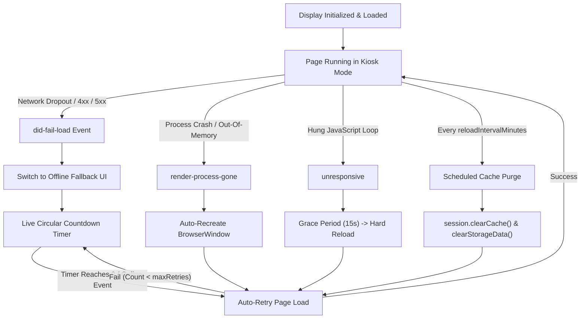

# Resilience, Watchdog & Recovery

Unattended digital signage systems must operate reliably 24 hours a day, 365 days a year without human intervention. Webpage Signage Runner incorporates a multi-tiered **Self-Healing Watchdog Architecture** to mitigate network interruptions, renderer crashes, and long-term memory leaks.

---

## 🛡️ Watchdog Architecture Overview



---

## 🔌 1. Network Failure & Branded Offline Fallback

When a display fails to load its target URL (e.g. DNS failure, Wi-Fi disconnect, corporate proxy error, or server downtime):

1. **Failure Interception:** The watchdog intercepts the Electron `did-fail-load` event.
2. **Offline Fallback UI:** Immediately swaps the view to the local `offline.html` page without showing standard Chromium dinosaur or raw network error codes.
3. **Animated Circular Countdown:** Displays a sleek dark-mode interface with a live pulsing circular SVG countdown timer showing the seconds remaining until the next retry attempt (`retryIntervalSeconds`).
4. **Instant Online Reconnection:** The offline page registers an event listener for `window.addEventListener('online', ...)`. If the operating system's network adapter reconnects, the countdown is immediately aborted and the target URL reloads instantly.
5. **Diagnostics Display:** Displays human-readable error descriptions (e.g., `ERR_INTERNET_DISCONNECTED`, `ERR_CONNECTION_REFUSED`, `ERR_NAME_NOT_RESOLVED`) and current retry attempt numbers.

---

## 💥 2. Renderer Crash & OOM Auto-Recovery

Heavy web dashboards (such as Grafana, PowerBI, Tableau, or complex WebGL 3D visualizations) can occasionally crash the underlying Chromium renderer process due to Out-Of-Memory (OOM) or GPU driver faults.

- **`render-process-gone` Interception:** The watchdog detects the crash reason (`crashed`, `oom`, `killed`, `integrity-failure`).
- **Clean Window Destruction:** Disposes of the hung window and native frame handles.
- **Window Reconstruction:** Creates a fresh `BrowserWindow` instance pinned to the exact physical screen bounds and reloads the configured URL without requiring an OS or process restart.

---

## ⏱️ 3. Unresponsive Window Watchdog

If third-party JavaScript executes an infinite loop or locks the UI thread:

- **`unresponsive` Event Detection:** Detects when the renderer stops responding to IPC heartbeats.
- **Grace Period:** Waits for `unresponsiveTimeoutSeconds` (default: 15s) to allow temporary high CPU spikes to clear.
- **Forced Recovery:** If still unresponsive after the timeout, forces a hard renderer reload.

---

## 🧹 4. 24/7 Chromium Memory Cache Purging

Chromium browsers naturally accumulate cached assets, decoded images, and JavaScript V8 heap objects over days of continuous operation.

- **Scheduled Cycle:** Every `reloadIntervalMinutes` (default: 60 minutes), the watchdog executes:
  ```typescript
  await window.webContents.session.clearCache();
  await window.webContents.session.clearStorageData({
    storages: ['appcache', 'shadercache', 'serviceworkers', 'cachestorage']
  });
  window.webContents.reloadIgnoringCache();
  ```
- **Result:** Drastically reduces long-term memory footprint, preventing gradual slowdowns or OOM crashes in 24/7/365 production installations.

---

## 📝 5. Rotating Structured File Logging

Logs are automatically written to:
- **Windows:** `%APPDATA%\webpage-signage-runner\logs\signage-YYYY-MM-DD.log`
- **Linux:** `~/.config/webpage-signage-runner/logs/signage-YYYY-MM-DD.log`

- **Log Rotation:** Automatically rotates logs daily.
- **Retention:** Enforces automatic 7-day retention to prevent disk fill-up.
- **Levels:** Color-coded console and file outputs for `DEBUG`, `INFO`, `WARN`, and `ERROR`.
